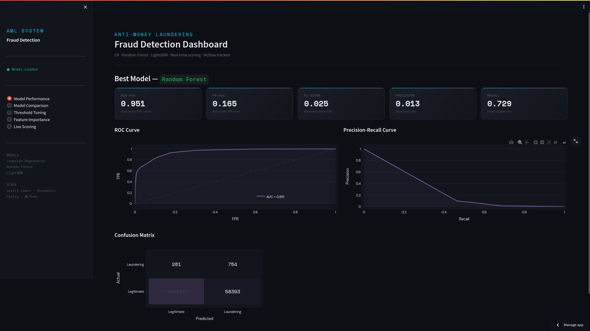
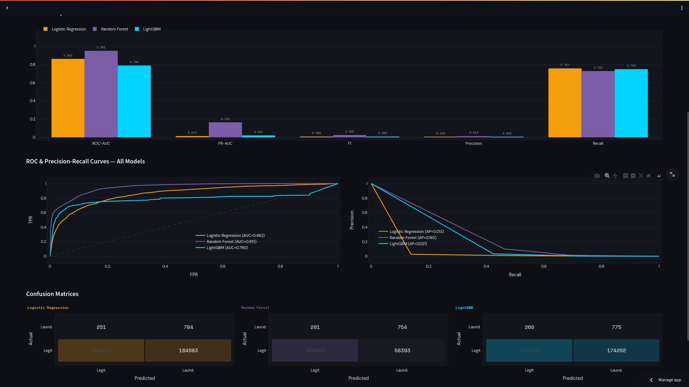
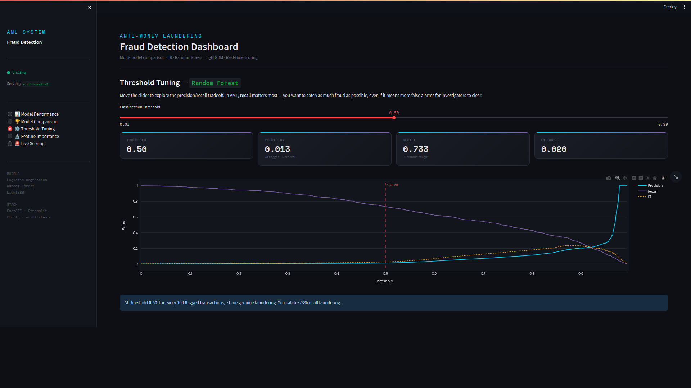
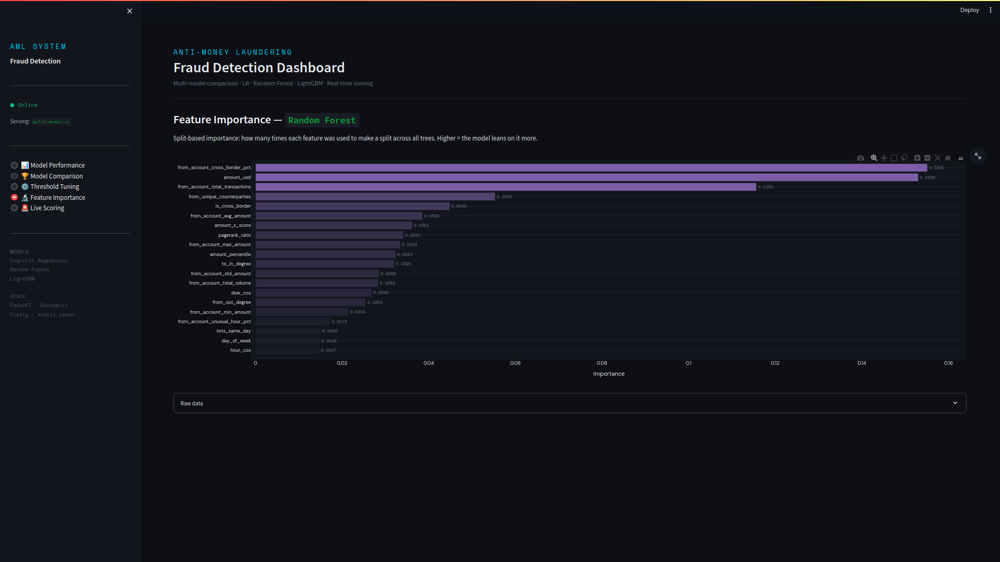
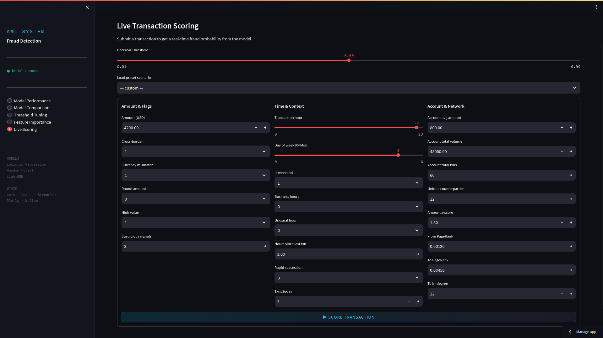

# AML Fraud Detection System

> End-to-end Anti-Money Laundering transaction scoring pipeline — from raw financial data to a real-time API and interactive analytics dashboard.


---

## Overview

This project implements a Medallion Architecture to process and analyze over 5 million transactions from the [IBM AML dataset](https://ibm.ent.box.com/v/AML-Anti-Money-Laundering-Data). It transitions data from raw ingestion to refined feature sets for anomaly detection.

---

## Pipeline Architecture

```
Raw CSV
   │
   ▼
┌─────────────────────────────┐
│  BRONZE LAYER               │  Exact copy of source data.
└─────────────────────────────┘
   │
   ▼
┌─────────────────────────────┐
│  SILVER LAYER               │  Cleaned, standardised, deduplicated.
└─────────────────────────────┘
   │
   ▼
┌─────────────────────────────┐
│  GOLD LAYER                 │  33 engineered features.
└─────────────────────────────┘
   │
   ▼
┌─────────────────────────────┐
│  MODEL TRAINING             │  LR · Random Forest · LightGBM
└─────────────────────────────┘
   │
   ▼
┌─────────────────────────────┐
│  SERVING                    │  FastAPI + Streamlit. Real-time scoring.
└─────────────────────────────┘
```

---

## Feature Engineering

33 features across 5 categories:

**Temporal** — Cyclical sin/cos encoding of hour and day-of-week.

**Transaction flags** — Cross-border indicator, currency mismatch, round-amount detection, high-value flag.

**Account behavioural aggregates** — Rolling statistics per sender account: mean, std, total volume, unique counterparties, historical cross-border rate.

**Velocity & anomaly** — Amount z-score vs account history, percentile rank, hours since last transaction, rapid succession flag, same-day transaction count.

**Network / graph** — PageRank scores for sender and receiver, in/out-degree counts, PageRank ratio.

---

## Modelling

### Model Selection

| Model | Role | Imbalance handling |
|---|---|---|
| **Logistic Regression** | Linear baseline — fast, interpretable | `class_weight="balanced"` |
| **Random Forest** | Non-linear ensemble baseline | `class_weight="balanced"` |
| **LightGBM** | Boosted trees for tabular data | `scale_pos_weight` = neg/pos ratio |

### PR-AUC over ROC-AUC

On a dataset where 98% of transactions are legitimate, a model predicting "never fraud" achieves 98% accuracy and a misleadingly good ROC-AUC. Precision-Recall AUC focuses entirely on performance against the minority class.

### Class imbalance strategy

```
scale_pos_weight (LightGBM) = n_negatives / n_positives
→ Each fraud sample weighted proportionally higher in the loss function
```

Combined with a **stratified train/test split** and a **tunable classification threshold** exposed at inference time — no retraining needed to adjust sensitivity.

---
## Results

| Model | ROC-AUC | PR-AUC | F1 | Precision | Recall |
|---|---|---|---|---|---|
| Logistic Regression | 0.8619 | 0.0133 | 0.0084 | 0.0042 | 0.7585 |
| **Random Forest** | 0.9511 | 0.1604 | 0.0262 | 0.0134 | 0.7333 |
| LightGBM  | 0.7709 | 0.0118 | 0.0109 | 0.0055 | 0.7382 |


## API

```bash
uvicorn src.api.main:app --reload
# Interactive docs → http://localhost:8000/docs
```

| Method | Endpoint | Description |
|---|---|---|
| `GET` | `/health` | Model status and version |
| `POST` | `/predict?threshold=0.5` | Score a single transaction |
| `GET` | `/metrics` | Best model metrics + curve data |
| `GET` | `/metrics/{model_name}` | Per-model metrics |
| `GET` | `/comparison` | All three models side by side |
| `GET` | `/features?top_n=20` | Feature importances |

**Example request:**
```bash
curl -X POST "http://localhost:8000/predict?threshold=0.4" \
  -H "Content-Type: application/json" \
  -d '{"amount_usd": 9900.0, "is_cross_border": 1, "amount_z_score": 4.5, ...}'
```

**Example response:**
```json
{
  "fraud_probability": 0.8934,
  "is_laundering": true,
  "threshold": 0.4,
  "risk_level": "HIGH",
  "model_version": "multi-model-v1"
}
```

---

## Dashboard

<details>
<summary>📊 <strong>Model Performance</strong> — ROC curve, PR curve, confusion matrix and key metrics for the best model</summary>
<br>

</details>
<details>
<summary>🏆 <strong>Model Comparison</strong> — All three models side by side: grouped bar chart, overlaid ROC and PR curves, confusion matrices</summary>
<br>

</details>
<details>
<summary>⚙️ <strong>Threshold Tuning</strong> — Live slider: instantly see how precision, recall and F1 respond as the threshold moves</summary>
<br>

</details>
<details>
<summary>🔬 <strong>Feature Importance</strong> — What the model actually learned to look at</summary>
<br>

</details>
<details>
<summary>🚨 <strong>Live Scoring</strong> — Submit a transaction, get a real-time fraud probability gauge and risk classification</summary>
<br>

</details>


---

## Quickstart

```bash
# 1. Clone and install
git clone https://github.com/emosantos/aml-fraud-detection.git
cd aml-fraud-detection
python -m venv venv && source venv/bin/activate
pip install -r requirements.txt

# 2. Add data
# data/gold_layer/engineered_features.parquet

# 3. Train all three models
python -m src.models.train

# 4. Start the API  (terminal 1)
uvicorn src.api.main:app --reload

# 5. Start the dashboard  (terminal 2)
streamlit run streamlit_app.py
```

## Project Structure

```
aml-fraud-detection/
├── src/
│   ├── ingestion/               # Bronze layer
│   ├── processing/              # Silver layer
│   ├── features/                # Gold layer — feature engineering
│   ├── models/
│   │   └── train.py             # Multi-model training pipeline
│   └── api/
│       ├── main.py              # FastAPI application
│       └── schemas.py           # Pydantic request/response schemas
├── streamlit_app.py             # Interactive dashboard
├── models/                      # Trained artifacts (gitignored)
│   ├── best_model.pkl
│   ├── comparison.json
│   ├── metrics.json
│   └── feature_importance.json
├── data/
│   ├── raw/                     # Bronze
│   ├── processed/               # Silver
│   └── gold_layer/              # Gold — model input
├── docker/
└── requirements.txt
```

---

## Tech Stack

| Layer | Technology |
|---|---|
| Data processing | Pandas, NumPy, PyArrow |
| Graph features | NetworkX (PageRank) |
| ML models | scikit-learn, LightGBM |
| API | FastAPI, Pydantic, Uvicorn |
| Dashboard | Streamlit, Plotly |
| Infrastructure | PostgreSQL, Docker |

---

